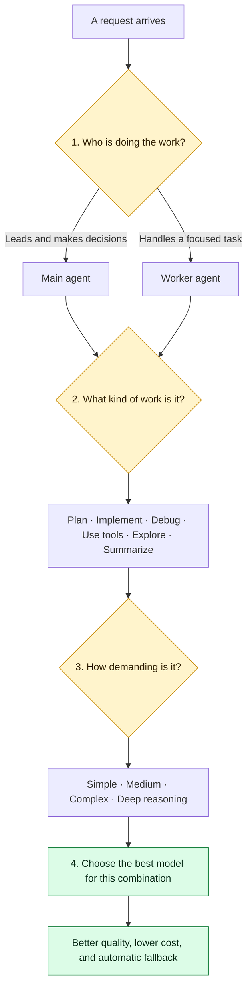
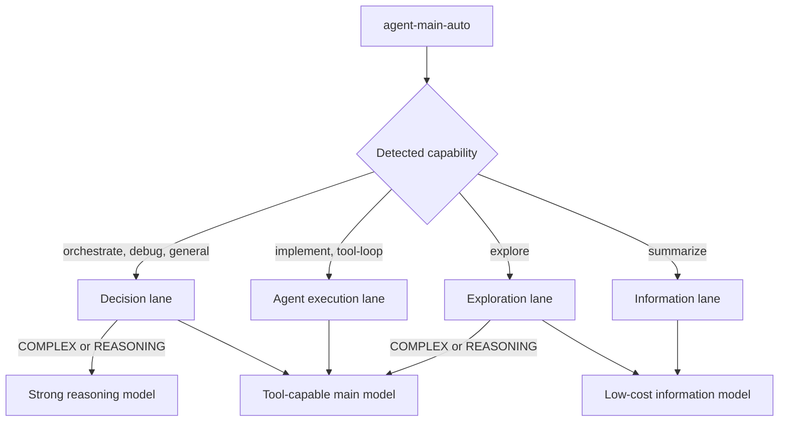
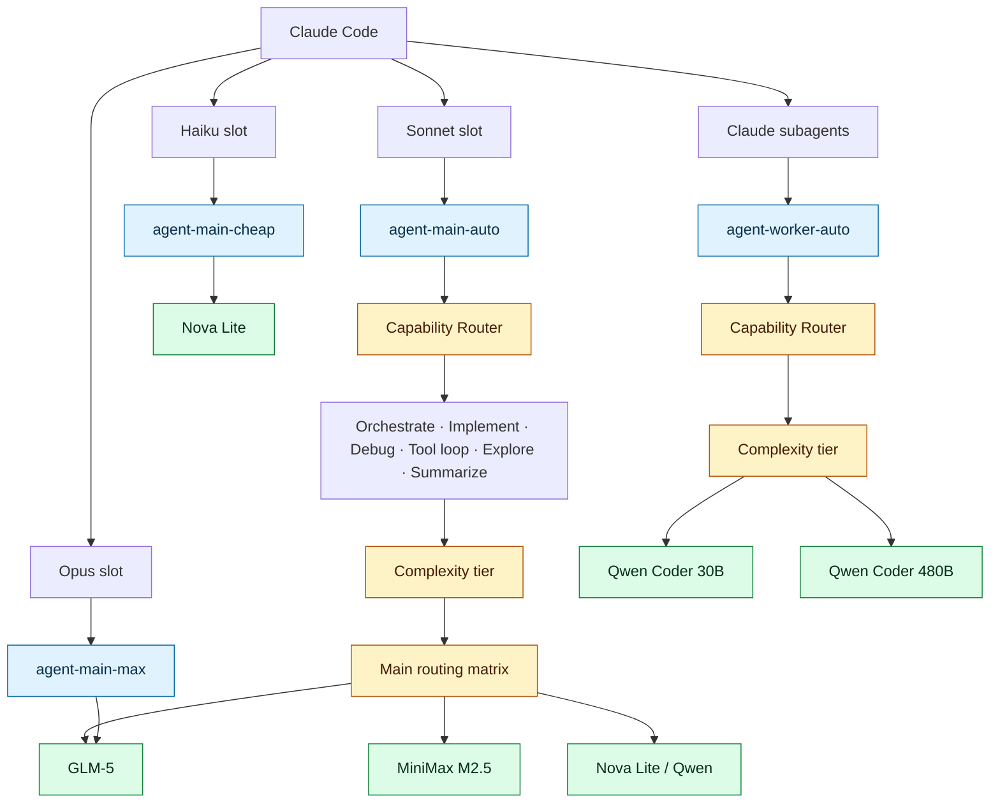

# Bifrost Capability Plugin

A native Go `PreRequestHook` for [Bifrost](https://github.com/maximhq/bifrost) that routes agent requests by role, capability, and effort.

The plugin classifies *what the agent is doing*. Bifrost's built-in Complexity Router classifies *how difficult the request is*. CEL rules combine both signals and select the physical model and fallback chain.

## The idea

One model should not do every kind of work. This plugin turns each request into a simple four-step decision, then sends it to the model best suited to the job.



`ROLE` says who is working. `CAPABILITY` says what they are doing. `COMPLEXITY` says how difficult it is. Bifrost then selects the model and fallback chain.

## Main-agent routing example



## Claude Code architecture

Claude Code can keep its familiar Sonnet, Opus, and Haiku slots while Bifrost decides which underlying model should actually serve each request.



The Sonnet slot becomes the dynamic main agent. Opus and Haiku become deterministic maximum and inexpensive escape hatches. Claude subagents use the worker lane. The names remain familiar to Claude Code; Bifrost owns the real model choice.

The plugin never pins a provider or physical model. It rewrites only these aliases:

```text
agent-main-auto   -> agent-main-{capability}
agent-worker-auto -> agent-worker-{capability}
```

All other traffic bypasses the plugin. Deterministic aliases such as `agent-main-max`, `agent-main-cheap`, and existing `codex-*` routes remain under Bifrost control.

## Requirements

- Linux `amd64`
- Docker
- `curl`, `jq`, Python 3, `sha256sum`, and `flock`
- Bifrost v1.6.8 source at revision `dcf245fdb22fe39f77c721be9b8c76ad2da32b9b`
- A running Bifrost v1.6.8 gateway for validation and installation

Go plugins require the host and plugin to share the exact source graph, Go toolchain, CGO mode, build tags, and build settings. A separately compiled `.so` is not safe merely because its version numbers match.

## Setup

Clone the matching Bifrost source:

```bash
git clone --branch v1.6.8 https://github.com/maximhq/bifrost.git /tmp/bifrost-v1.6.8
cd /tmp/bifrost-v1.6.8
git checkout dcf245fdb22fe39f77c721be9b8c76ad2da32b9b
```

Clone this repository and configure the deployment templates:

```bash
git clone https://github.com/codex-corp/bifrost-capability-plugin.git
cd bifrost-capability-plugin
```

Review and adapt:

- `config/plugin.json`: aliases, active roles, confidence, and shadow mode.
- `config/models.json`: available provider/model identifiers and Virtual Key ID.
- `config/routing-rules.json`: CEL rules, targets, fallbacks, scope, and priorities.
- `config/lanes.json`: human-readable lane inventory.

Never commit credentials or an exported Bifrost database.

## Build and verify

```bash
./router.sh validate
./router.sh build
./router.sh test-candidate
```

`build` creates one matched artifact set under `.build/matched/`:

- Bifrost host executable with the embedded UI
- official Bifrost test plugin
- minimal ABI probe
- capability-router plugin

`test-candidate` starts the matched host on `127.0.0.1:11020`, loads all plugins, checks the UI and version, and sends a shadow request to a local fake OpenAI upstream. It never contacts a real model provider.

## Install

First deploy the matched Bifrost executable at a stable path and configure your service to use it. Keep the original service definition and executable as rollback artifacts.

```bash
install -d "$HOME/.local/lib/bifrost/v1.6.8-matched"
install -m 0755 .build/matched/bifrost-http \
  "$HOME/.local/lib/bifrost/v1.6.8-matched/bifrost-http"
```

Start the matched host with the same address and app directory as the existing gateway:

```text
~/.local/lib/bifrost/v1.6.8-matched/bifrost-http \
  -host 127.0.0.1 \
  -port 10020 \
  -app-dir ~/.config/bifrost
```

Verify before installing the router:

```bash
curl -fsS http://127.0.0.1:10020/health
curl -fsS http://127.0.0.1:10020/api/version
curl -fsS -o /dev/null -w '%{http_code}\n' http://127.0.0.1:10020/
./router.sh status
```

Then install the plugin and additive `Agent CR` rules:

```bash
./router.sh apply
./router.sh status
```

`apply` refuses to continue unless the running executable matches the isolated, tested candidate. It backs up the current Bifrost configuration before changing the plugin or rules.

## Usage

Use a Bifrost Virtual Key and one of the automatic aliases:

```bash
curl http://127.0.0.1:10020/openai/v1/chat/completions \
  -H "Authorization: Bearer $BIFROST_API_KEY" \
  -H 'Content-Type: application/json' \
  -d '{
    "model": "agent-main-auto",
    "messages": [
      {"role": "user", "content": "Design a safe migration plan."}
    ]
  }'
```

Available entry aliases:

| Alias | Purpose |
|---|---|
| `agent-main-auto` | Capability-routed main agent |
| `agent-worker-auto` | Capability-routed worker |
| `agent-main-max` | Deterministic maximum-capability route |
| `agent-main-cheap` | Deterministic inexpensive route |

## Updating configuration

For model, fallback, CEL, or plugin-setting changes:

```bash
./router.sh validate
./router.sh apply
./router.sh status
```

No Bifrost rebuild is required for configuration-only changes.

## Updating Go code or Bifrost

Host and plugin must move together:

```bash
./router.sh build
./router.sh test-candidate
```

Then:

1. Disable the existing plugin.
2. Atomically install the newly matched host and plugin.
3. Restart Bifrost.
4. Verify health, UI, version, and runtime hash.
5. Run `./router.sh apply`.
6. Test representative main and worker requests.

Never load a newly built plugin into an older host process.

## Rollback

Remove only this plugin and its `Agent CR` rules:

```bash
./router.sh rollback
```

Existing non-`Agent CR` rules are preserved. Restore the previous service executable separately if the matched host itself must be rolled back.

## Troubleshooting

### `plugin.Open` or `plugin has empty pluginpath`

The host and plugin were not built from an identical environment. Run `build` and `test-candidate`, then deploy both matched artifacts together.

### `could not auto resolve a provider`

The plugin is disabled, still in shadow mode, or ordered after provider resolution. Confirm it is active, uses `pre_builtin` placement, and receives `agent-main-auto` or `agent-worker-auto`.

### Unexpected model

Inspect Bifrost routing logs for the capability lane, complexity tier, first matching rule, selected target, and fallback status. Avoid mixing unrelated capability instructions in one test prompt.

## Development

```bash
docker run --rm \
  -v "$PWD:/src" \
  -w /src \
  golang:1.26.5 \
  sh -c 'go test ./... && go vet ./...'
```

The classifier is deterministic and dependency-light. Add table-driven tests for every new signal or transition.

## License

No license has been selected yet. Add an OSI-approved license before publishing the repository as open source.
