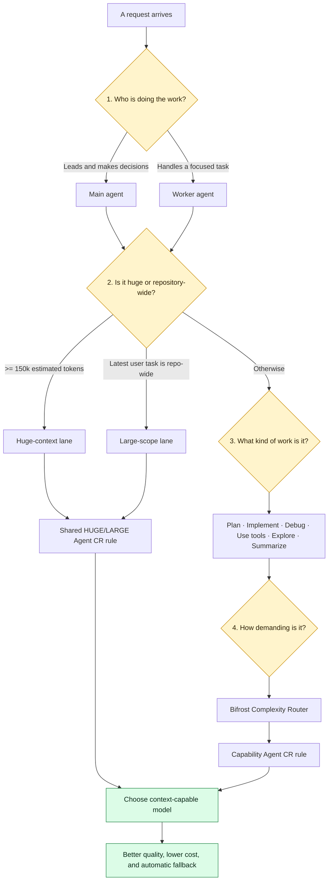
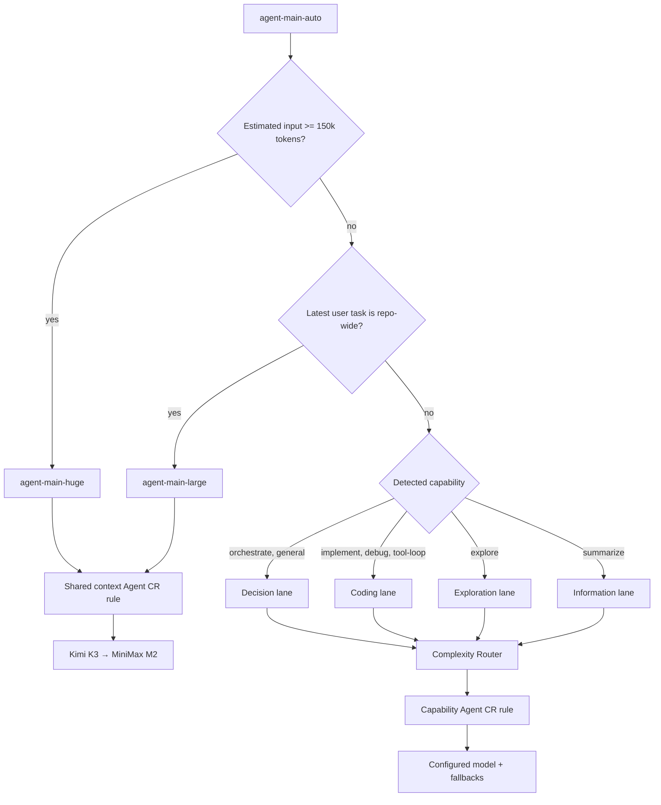
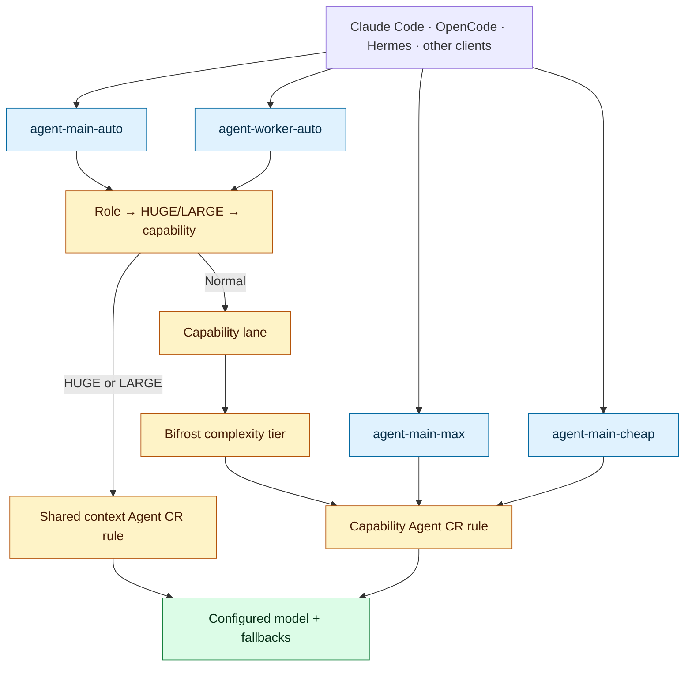

# Bifrost Capability Plugin

A native Go `PreRequestHook` for [Bifrost](https://github.com/maximhq/bifrost) that routes agent requests by role, context/scope, capability, and effort.

The plugin classifies *what the agent is doing*. Bifrost's built-in Complexity Router classifies *how difficult the request is*. CEL rules combine both signals and select the physical model and fallback chain.

## The idea

One model should not do every kind of work. This plugin turns each request into a small routing decision, then lets Bifrost send it to the model best suited to the job.


```mermaid
flowchart TD
    R["A request arrives"] --> ROLE{"1. Who is doing the work?"}
    ROLE -->|"Leads and makes decisions"| MAIN["Main agent"]
    ROLE -->|"Handles a focused task"| WORKER["Worker agent"]
    MAIN --> SCOPE{"2. Is it huge or repository-wide?"}
    WORKER --> SCOPE
    SCOPE -->|">= 150k estimated tokens"| HUGE["Huge-context lane"]
    SCOPE -->|"Latest user task is repo-wide"| LARGE["Large-scope lane"]
    SCOPE -->|"Otherwise"| CAP{"3. What kind of work is it?"}
    CAP --> TYPES["Plan · Implement · Debug · Use tools · Explore · Summarize"]
    HUGE --> SHARED["Shared HUGE/LARGE Agent CR rule"]
    LARGE --> SHARED
    SHARED --> MODEL["Choose context-capable model"]
    TYPES --> EFFORT{"4. How demanding is it?"}
    EFFORT --> LEVELS["Bifrost Complexity Router"]
    LEVELS --> RULE["Capability Agent CR rule"]
    RULE --> MODEL
    MODEL --> RESULT["Better quality, lower cost, and automatic fallback"]

    classDef question fill:#fff4cc,stroke:#c88a00,color:#332100;
    classDef outcome fill:#dcfce7,stroke:#16803c,color:#082d18;
    class ROLE,SCOPE,CAP,EFFORT question;
    class MODEL,RESULT outcome;
```

`ROLE` says who is working. `SCOPE` recognizes huge payloads and explicit repository-wide tasks. `CAPABILITY` says what the agent is doing. `COMPLEXITY` says how difficult it is. Bifrost then selects the physical model and fallback chain.

## Main-agent routing example


```mermaid
flowchart TD
    A["agent-main-auto"] --> H{"Estimated input >= 150k tokens?"}
    H -->|"yes"| HC["agent-main-huge"]
    H -->|"no"| L{"Latest user task is repo-wide?"}
    L -->|"yes"| LC["agent-main-large"]
    L -->|"no"| C{"Detected capability"}
    C -->|"orchestrate, general"| D["Decision lane"]
    C -->|"implement, debug, tool-loop"| T["Coding lane"]
    C -->|"explore"| E["Exploration lane"]
    C -->|"summarize"| S["Information lane"]
    HC --> SHARED["Shared context Agent CR rule"]
    LC --> SHARED
    SHARED --> K["Kimi K3 → MiniMax M2"]
    D --> CR["Complexity Router"]
    T --> CR
    E --> CR
    S --> CR
    CR --> RULES["Capability Agent CR rule"]
    RULES --> M["Configured model + fallbacks"]
```

## Client-agnostic architecture

Claude Code, OpenCode, Hermes, and other compatible clients share the same aliases. Clients identify the agent role; the plugin and Bifrost make the remaining decisions.


```mermaid
flowchart TD
    CLIENTS["Claude Code · OpenCode · Hermes · other clients"]
    CLIENTS --> MAIN_AUTO["agent-main-auto"]
    CLIENTS --> WORKER_AUTO["agent-worker-auto"]
    CLIENTS --> MAIN_MAX["agent-main-max"]
    CLIENTS --> MAIN_CHEAP["agent-main-cheap"]

    MAIN_AUTO --> ROUTER["Role → HUGE/LARGE → capability"]
    WORKER_AUTO --> ROUTER
    ROUTER -->|"HUGE or LARGE"| SHARED["Shared context Agent CR rule"]
    ROUTER -->|"Normal"| CAPABILITY["Capability lane"]
    CAPABILITY --> COMPLEXITY["Bifrost complexity tier"]
    COMPLEXITY --> RULES["Capability Agent CR rule"]
    SHARED --> MODELS["Configured model + fallbacks"]
    RULES --> MODELS

    MAIN_MAX --> RULES
    MAIN_CHEAP --> RULES

    classDef entry fill:#e0f2fe,stroke:#0369a1,color:#082f49;
    classDef router fill:#fef3c7,stroke:#b45309,color:#451a03;
    classDef model fill:#dcfce7,stroke:#15803d,color:#052e16;
    class MAIN_AUTO,MAIN_MAX,MAIN_CHEAP,WORKER_AUTO entry;
    class ROUTER,SHARED,CAPABILITY,COMPLEXITY,RULES router;
    class MODELS model;
```

The plugin never pins a provider or physical model. It rewrites only these aliases:

```text
agent-main-auto   -> agent-main-{huge|large|capability}
agent-worker-auto -> agent-worker-{huge|large|capability}
```

HUGE uses `ceil(non-opaque UTF-8 textual bytes / 4)` across the complete current textual request. Non-opaque map/property names are included because schema and tool keys consume context. The default threshold is `150000` estimated input tokens. Image URLs, file/base64 data, data URLs, and opaque data fields are excluded.

LARGE examines only the latest non-empty user message in the complete request history. A later focused user task replaces an older repository-wide task as the anchor; assistant messages, tool calls, and tool results cannot trigger LARGE. HUGE always takes precedence over LARGE, and LARGE takes precedence over capability classification.

All other traffic bypasses the plugin. Deterministic aliases such as `agent-main-max`, `agent-main-cheap`, and existing `codex-*` routes remain under Bifrost control.

The current model policy is deliberately split by strength:

| Model | Role |
|---|---|
| GLM-5 | Main reasoning and orchestration |
| MiniMax M2.5 | Agentic/reasoning fallback |
| MiniMax M2 | One-million-token context fallback |
| Kimi K3 | LARGE/HUGE requests and hard exploration |
| Qwen Coder 480B | Hard coding and debugging |
| Qwen Coder 30B | Normal coding |
| Devstral 2 | Coding fallback |
| Nemotron Nano 30B | Cheap, simple, and summarization work |

Two shared rules serve both roles before the capability rules:

```text
Agent CR 020 huge context (priority 220)
  agent-main-huge | agent-worker-huge
  -> Kimi K3 -> MiniMax M2

Agent CR 030 large scope (priority 230)
  agent-main-large | agent-worker-large
  -> Kimi K3 -> MiniMax M2
```

All existing capability rules remain authoritative in `config/routing-rules.json`.

## Configure the Complexity Router

The capability plugin supplies the role-derived lane, including scope or capability. Bifrost's
Complexity Router supplies `complexity_tier`; the Agent CR CEL rules combine
both values. Enable the Complexity Router before enabling live Agent CR rules.

For a Bedrock deployment, configure the Complexity Router in the Bifrost
Dashboard (or its routing API) with an embedding model available to the same
provider key. The current validated local setup is:

```json
{
  "tier_boundaries": {
    "simple_medium": 0.2,
    "medium_complex": 0.4
  },
  "semantic": {
    "provider": "bedrock",
    "embedding_model": "cohere.embed-multilingual-v3",
    "timeout": "1.5s",
    "min_similarity": 0.6,
    "message_history_count": 1,
    "vector_store": "embedded",
    "fallback": "none"
  }
}
```

Use the model identifier exposed by your own Bifrost installation; do not copy
this example when that model is unavailable in your region. Saving a changed
provider or embedding model re-embeds the reference phrases and invalidates
the stored vectors. Verify the result with:

```bash
curl -fsS http://127.0.0.1:10020/api/routing/complexity-analyzer-config | jq .
./router.sh validate
```

The plugin must be placed before built-in governance (`pre_builtin`, order `0`)
so its capability metadata is present when the Complexity Router and CEL rules
run. Configure the Virtual Key to permit the embedding provider plus every
Agent CR target and fallback. `router.sh apply-rules` installs only the
additive Agent CR rules; it does not modify existing `OC v2` rules.

## Release compatibility

The published plugin and Bifrost executable are one tested ABI pair. Bifrost's
standard static executable cannot load Go plugins, and a `.so` built with a
different source graph, Go toolchain, architecture, libc, or build flags is not
compatible even when both products report the same version.

Published releases support Linux AMD64 with glibc only. Do not install their `.so`
into Bifrost's stock static executable, Alpine/musl, ARM64, or an independently
built dynamic host.

## Install the release

Download all four assets from the matching release tag and verify them. The
following uses the current revision release as an example:

```bash
base='https://github.com/codex-corp/bifrost-capability-plugin/releases/download/bifrost-v2.2.0-r2'
curl -fLO "$base/agent-capability-router-bifrost-v2.2.0-linux-amd64-glibc.so"
curl -fLO "$base/bifrost-http-bifrost-v2.2.0-linux-amd64-glibc"
curl -fLO "$base/bifrost-capability-plugin-bifrost-v2.2.0-r2-linux-amd64-glibc.tar.gz"
curl -fLO "$base/SHA256SUMS"
sha256sum -c SHA256SUMS
tar -xzf bifrost-capability-plugin-bifrost-v2.2.0-r2-linux-amd64-glibc.tar.gz
cd bifrost-capability-plugin-bifrost-v2.2.0-r2-linux-amd64-glibc
```

Install the matched host at a versioned path, point your Bifrost service at it,
and start it with the existing app directory. Keep the previous executable and
database backup for rollback.

```bash
install -d "$HOME/.local/lib/bifrost/v2.2.0-matched"
install -m 0755 .build/matched/bifrost-http \
  "$HOME/.local/lib/bifrost/v2.2.0-matched/bifrost-http"
curl -fsS http://127.0.0.1:10020/health
curl -fsS http://127.0.0.1:10020/api/version
```

Enable Dashboard administrator authentication, then open **Plugins → Install
New Plugin** and enter:

```text
Name: agent-capability-router
Path/URL: https://github.com/codex-corp/bifrost-capability-plugin/releases/download/bifrost-v2.2.0-r2/agent-capability-router-bifrost-v2.2.0-linux-amd64-glibc.so
```

Enable configuration and paste the plugin-specific object:

```json
{
  "shadow_mode": true,
  "confidence_threshold": 0.7,
  "history_messages": 8,
  "huge_token_threshold": 150000,
  "active_roles": {"main": true, "worker": true},
  "aliases": {
    "main": "agent-main-auto",
    "worker": "agent-worker-auto",
    "max": "agent-main-max",
    "cheap": "agent-main-cheap"
  }
}
```

Bifrost places new custom plugins after its built-ins by default. Open **Edit
Plugin Sequence**, move `agent-capability-router` above **Built-in Plugins**, and
save. The resulting placement must be `pre_builtin`, order `0`, so capability
metadata exists before governance routing evaluates the request.

Configure the Bedrock model inventory and Virtual Key, then install only the
additive routing rules. This does not replace the Dashboard-managed plugin
path or configuration.

```bash
./install.sh configure
./router.sh validate
./router.sh apply-rules
./router.sh status
```

Inspect shadow logs with `./router.sh logs`. When classifications and rule
matches are correct, edit the plugin in the Dashboard and change
`shadow_mode` to `false`.

## Source-build requirements

- Linux `amd64`
- Docker
- `curl`, `jq`, Python 3, `sha256sum`, and `flock`
- Bifrost v2.2.3 source at the matching `transports/v2.2.3` revision
- Go 1.27.0, Bifrost core v1.10.2, and framework v1.7.4
- A running Bifrost v2.2.3 gateway for validation and installation
- Bifrost Complexity Router configured and available
- An active Virtual Key that permits Bedrock and every configured model
- Dashboard administrator authentication when creating or changing a custom plugin path

Go plugins require the host and plugin to share the exact source graph, Go toolchain, CGO mode, build tags, and build settings. A separately compiled `.so` is not safe merely because its version numbers match.

## Build from source

Clone the matching Bifrost source:

```bash
git clone --branch transports/v2.2.3 https://github.com/maximhq/bifrost.git /tmp/bifrost-v2.2.3
cd /tmp/bifrost-v2.2.3
```

Clone this repository and configure the deployment templates:

```bash
git clone https://github.com/codex-corp/bifrost-capability-plugin.git
cd bifrost-capability-plugin
```

Review and adapt:

- `config/plugin.json`: aliases, active roles, and confidence defaults.
- `config/models.json`: Bedrock model identifiers available to your provider key.
- `config/routing-rules.json`: CEL rules, targets, fallbacks, and priorities.
- `config/lanes.json`: human-readable lane inventory.

Never commit credentials or an exported Bifrost database.

Configure an existing Virtual Key before validation. The interactive installer
lists safe Virtual Key metadata and verifies that the selected key is active,
permits Bedrock, and permits every configured target and fallback. Read the
[Bifrost Virtual Keys configuration guide](https://docs.getbifrost.ai/features/governance/virtual-keys#configuration)
before creating or selecting a key. Machine-specific settings are written to
ignored `.local/install.json`.

```bash
./install.sh configure
./install.sh check
```

The default is safe shadow mode. After observing classification logs, rerun with
`--live` and apply again to enable request rewriting:

```bash
./install.sh configure --virtual-key-id '<your-virtual-key-id>' --live
```

Use `--virtual-key-id` for scripted/non-interactive setup.

## Build and verify

```bash
./install.sh check
./router.sh validate
./router.sh build
./router.sh test-candidate
```

`build` creates one matched artifact set under `.build/matched/`:

- Bifrost host executable with the embedded UI
- official Bifrost test plugin
- minimal ABI probe
- capability-router plugin

`test-candidate` starts the matched host on `127.0.0.1:11020`, loads all plugins, checks the UI and version, and sends a shadow request to a local fake OpenAI upstream. It never contacts a real model provider.

## Publish a release

Release tags are version-driven. Push a tag in this form:

```bash
git tag -a bifrost-v2.2.0-r1 -m "Bifrost v2.2.0 plugin release"
git push origin bifrost-v2.2.0-r1
```

GitHub Actions checks out the matching `transports/v2.2.0` source, builds the
host and native plugin as one ABI pair, runs the isolated candidate test, and
publishes the plugin, matched host, complete bundle, and `SHA256SUMS`. Existing
releases are immutable; a new revision uses another `-rN` tag.

## Install

First deploy the matched Bifrost executable at a stable path and configure your service to use it. Keep the original service definition and executable as rollback artifacts.

```bash
install -d "$HOME/.local/lib/bifrost/v2.2.0-matched"
install -m 0755 .build/matched/bifrost-http \
  "$HOME/.local/lib/bifrost/v2.2.0-matched/bifrost-http"
```

Start the matched host with the same address and app directory as the existing gateway:

```text
~/.local/lib/bifrost/v2.2.0-matched/bifrost-http \
  -host 127.0.0.1 \
  -port 10020 \
  -app-dir ~/.config/bifrost
```

Verify before installing the router:

```bash
curl -fsS http://127.0.0.1:10020/health
curl -fsS http://127.0.0.1:10020/api/version
curl -fsS -o /dev/null -w '%{http_code}\n' http://127.0.0.1:10020/
./router.sh status
```

To let the command-line tooling manage both the local plugin file and the
additive `Agent CR` rules:

```bash
./router.sh apply
./router.sh status
```

`apply` refuses to continue unless the running executable matches the isolated, tested candidate. It backs up the current Bifrost configuration before changing the plugin or rules.
For a new custom-plugin registration, export `BIFROST_ADMIN_BEARER_TOKEN` or
`BIFROST_ADMIN_BASIC` with genuine administrator credentials. Bifrost v2 rejects
custom `.so` path mutations when dashboard authentication is disabled. Repeated
applies skip this protected mutation when the installed configuration already
matches.

## Usage

Use a Bifrost Virtual Key and one of the automatic aliases:

```bash
curl http://127.0.0.1:10020/openai/v1/chat/completions \
  -H "Authorization: Bearer $BIFROST_API_KEY" \
  -H 'Content-Type: application/json' \
  -d '{
    "model": "agent-main-auto",
    "messages": [
      {"role": "user", "content": "Design a safe migration plan."}
    ]
  }'
```

Available entry aliases:

| Alias | Purpose |
|---|---|
| `agent-main-auto` | Scope- and capability-routed main agent |
| `agent-worker-auto` | Scope- and capability-routed worker |
| `agent-main-max` | Deterministic maximum-capability route |
| `agent-main-cheap` | Deterministic inexpensive route |

## Updating configuration

For Dashboard-managed installations, update model, fallback, or CEL templates
with the rules-only path:

```bash
./install.sh check
./router.sh validate
./router.sh apply-rules
./router.sh status
```

Edit plugin settings in the Dashboard. For command-line-managed installations:

```bash
./install.sh check
./router.sh validate
./router.sh apply
./router.sh status
```

No Bifrost rebuild is required for configuration-only changes.

## Updating Go code or Bifrost

Host and plugin must move together:

```bash
./router.sh build
./router.sh test-candidate
```

When upgrading from Bifrost v1.x, back up `config.json`, `config.db*`, and
`logs.db*` before first starting v2. Bifrost v2 includes non-reversible
storage migrations; after they run, restore the database backup as well as the
old executable if a downgrade is required.

Then:

1. Stop Bifrost and take the database and service-definition backup.
2. Install the newly matched host at a versioned path.
3. Point the service at that host and restart Bifrost.
4. Verify health, UI, and `v2.2.0` before continuing.
5. Run `./router.sh validate`, then `./router.sh apply`.
6. Verify all nine `Agent CR` rules and test representative main and worker requests.

Never load a newly built plugin into an older host process.

For a published update, download and verify the new release, replace the host
with the host from that same release, then delete and reinstall the Dashboard
plugin using the new release URL. Do not combine a host from one release with a
plugin from another.

## Rollback

Remove only this plugin and its `Agent CR` rules:

```bash
./router.sh rollback
```

Existing non-`Agent CR` rules are preserved. Restore the previous service executable separately if the matched host itself must be rolled back.

For a Dashboard-managed installation, remove the plugin in the Dashboard first,
then run `./router.sh rollback` to remove the additive rules. The plugin delete
performed by `rollback` is harmless when it is already absent.

## Troubleshooting

### `plugin.Open` or `plugin has empty pluginpath`

The host and plugin were not built from an identical environment. Run `build` and `test-candidate`, then deploy both matched artifacts together.

### `could not auto resolve a provider`

The plugin is disabled, still in shadow mode, or ordered after provider resolution. Confirm it is active, uses `pre_builtin` placement with order `0`, and receives `agent-main-auto` or `agent-worker-auto`.

### Unexpected model

Inspect Bifrost routing logs for `scope`, `estimated_input_tokens`, capability lane, complexity tier, first matching rule, selected target, and fallback status. Avoid mixing unrelated capability instructions in one test prompt.

## Development

```bash
docker run --rm \
  -v "$PWD:/src" \
  -w /src \
  golang:1.27.0 \
  sh -c 'go test ./... && go vet ./...'
```

The classifier is deterministic and dependency-light. Add table-driven tests for every new signal or transition.

## License

MIT. See `LICENSE`.
